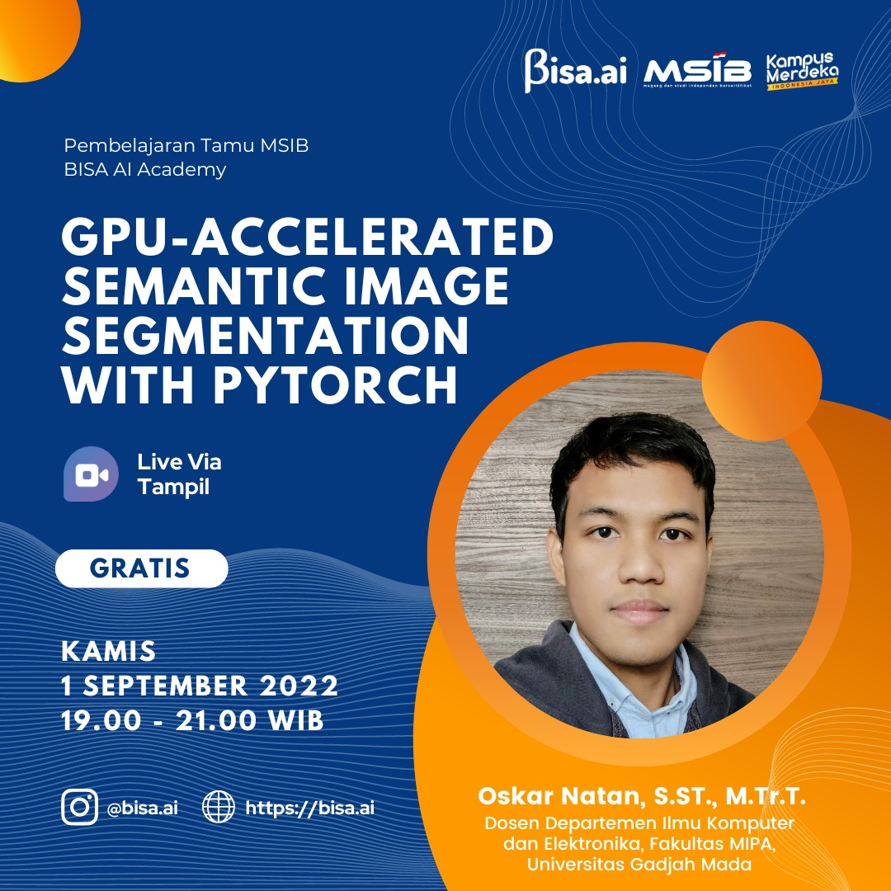

# GPU-accelerated Semantic Image Segmentation with PyTorch

Implementasi program untuk webinar yang diselenggarakan BISA AI dengan judul: \
GPU-accelerated Semantic Image Segmentation with PyTorch 

## Informasi webinar: 

[[link]](https://tampil.id/event/detail/VFdwWk1FNUJQVDA9) 

## STEP:
1. Download dan extract set dataset [cityscapes](https://www.cityscapes-dataset.com/) 
    - leftImg8bit_trainvaltest.zip (11GB)
    - gtFine_trainvaltest.zip (241MB)
2. Run jupyter notebook dan buka semseg.ipynb
3. Jalankan program sesuai instruksi yang tertulis di notebook